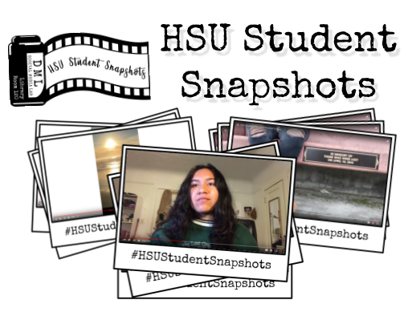
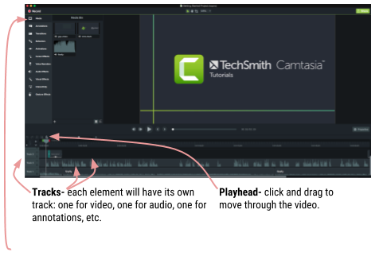

# Editing, Publishing &amp; Captions

## HSU Student Snapshots
“Student Snapshots” is a collection of video stories from Humboldt State University (HSU) students in their own voice. These stories are about the experiences of students as they live in Humboldt County and explore both the county and the HSU campus. Student Snapshots are quick 1-minute stories that share your unique experience from your own vantage point. Take a look at the [HSU Student Snapshots YouTube playlist](https://www.youtube.com/playlist?list=PLe7DUUoET6mUN1jP4pO6uKW9uyubSkQhC) (below) to see what people have already shared and then add your story.

<iframe width="560" height="315" src="https://www.youtube-nocookie.com/embed/V0VFkAwyfTU?rel=0" frameborder="0" allow="autoplay; encrypted-media" allowfullscreen></iframe>

This guide will help you with publishing and sharing your story. Visit the accompanying online guide for more links and info: [libguides.humboldt.edu/snapshots/learn](libguides.humboldt.edu/snapshots/learn).

## Digital Media Lab Quick Guide
This short guide will get you started with your project. For more information about this or with other digital media projects, visit [http://libguides.humboldt.edu/dml](http://libguides.humboldt.edu/dml).

## Camtasia
Available on all campus computers, Camtasia is a fully featured video editor that is pretty quick to learn. 

### Splitting & Trimming
Cut your video in two ways: 1) Hover your mouse over the end of your video clip. When the cursor changes to a double arrow, click and drag to change the start/end of the clip. 2) Click on the video clip you want to edit to select it, move the playhead to the right point on the timeline. Left-click on the playhead and select Split to cut the clip. 

### Annotations
Add shape or text elements using Annotations. These will show up on their own track- be sure it is above your video or else you won’t see it! Annotations are great for making titles, credits, pull quotes and any other textual information.

### Captions (Modify -> Captions)
It is extremely important that you include captions in your project. Many viewers will either have hearing issues or won’t have access to speakers or headphones. Captions are fairly easy to make with Camtasia or in YouTube. Having a script to copy and paste from makes it even easier. Visit [libguides.humboldt.edu/dml/captions](libguides.humboldt.edu/dml/captions) for details and tutorials. 

### Learn More
+ Camtasia tutorials: [https://www.techsmith.com/tutorial-camtasia.html](https://www.techsmith.com/tutorial-camtasia.html)
+ Online SkillShop: [https://canvas.humboldt.edu/enroll/PCALYE](https://canvas.humboldt.edu/enroll/PCALYE)
+ Email help: dml@humboldt.edu

## Audacity
Available on all campus computers, Audacity is an audio editing program that you can also download and use for free on any Windows, Mac or Linux computer. The learning curve may feel overwhelming but a few tricks will help you clean up some common problems.

+ Select — This is the basic tool that you’ll use most often to choose a starting point for playback, to copy and paste, and perform general tasks.
+ Envelope — Fine tune any volume adjustments. Click to create a point and then drag the point to raise or lower the volume. 
+ Draw — Manually re-draw the waveform.
+ Zoom — Select and zoom in on an area to get a better view.
+ Time Shift — Drag clips to sync up with one another or to even move a clip to another track.
+ Multi-tool — For experienced users, this tool allows you to use all of the others, automatically choosing which or allowing you to choose using keyboard shortcuts.

### Tips
Separate your audio from your video in a video editor. In Camtasia, you can export the audio from a video and clean it up in Audacity. To export, select _Share_, then _Export Audio Only_. After you've cleaned up your audio, upload it back to Camtasia: _File_, then _Import_, then _Audio_.

It’s always best to start off with a good recording (take your time to setup and use quality microphones) but sometimes you’re stuck with a less-than perfect recording and you need to make it work. These tools will help.

#### Noise removal
Get rid of background noise or hiss using this tool to first get a noise profile of the background noise and then filter that noise out. 
#### Normalize 
If you are working with several clips this tool will give them the same peak amplitude (every clip will have similar levels). 
#### Compressor 
Do you have audio that gets far too quiet at times and needs a boost? The compressor will help make those volume changes less severe, but it’s a complicated tool. View http://manual.audacityteam.org/man/compressor.html for more info on using the compressor.

## Other Video Editing Software Options
There are many ways for you to edit your footage. While Camtasia is available on all HSU campus computers, it isn’t free for you to use at home. Here are some other options you want to try: 

### Mobile Apps
+ [GoPro Splice](http://spliceapp.com/) (iOS, free) This app makes merging clips, adding text and music a snap. You can delete the final watermark page if you choose- no strings attached!
+ [Adobe Spark Video](https://itunes.apple.com/story/id1272824614) (iOS, soon on Android, free or $9/mo for no watermark) This app is similar to Splice and has some templates (try the Personal Growth option!) to help you get started. 

### Desktop
+ [Adobe Spark is also available on the web!](https://spark.adobe.com/home/)
+ [iMovie](https://www.apple.com/imovie/) (Mac, free) Only available on Macs (and iOS devices), this simple editor has many templates and animations to help you make your snapshot.
+ [Open Shot](https://www.openshot.org/) (Mac, Windows, Linux, free & open source). Much like Camtasia but with fewer features. Prone to crashing- be sure to save often!

### Add Your Project to Student Snapshots!
To submit your video to be added to the HSU Student Snapshots playlist, follow these instructions: 
1. Create your video -- borrow DML equipment and/or attend the Snapshots SkillShops for help. 
2. Upload your video to YouTube. 
3. Email HSUStudentSnapshots@gmail.com with a link to your video. 
4. Tell your friends  family -- tag your posts #HSUStudentSnapshots.

### Remixing Content
You don’t have to create everything from scratch. There are plenty of images, songs, sounds, and more that you can borrow from others:
+ Music
    + [Free Music Archive](http://freemusicarchive.org/)
    + [YouTube Audio Library](https://www.youtube.com/audiolibrary/music)
    + [SoundCloud Creative Commons](https://soundcloud.com/wearecc)
+ Sounds & sound effects
    + [SoundBible.com](http://soundbible.com/)
    + [Zapsplat.com](http://zapsplat.com/)
    + [Freesound.org](https://freesound.org/)
+ Photos & graphics
    + [Pixabay.com](https://pixabay.com/)
    + [Pexels.com](https://www.pexels.com/)
    + [Flickr](https://www.flickr.com/) (search by license type)

You can use public domain or creative commons content without getting permission from the artist, but you should give them attribution at the end of your video and include links in your video description.

---
For more info visit: [http://libguides.humboldt.edu/dml](http://libguides.humboldt.edu/dml) or email dml@humboldt.edu

This guide has an open [Creative Commons license](https://creativecommons.org/share-your-work/licensing-types-examples/). You can use, share, remix and repurpose this content as long as you attribute the authors, Jesse Garcia, Tim Miller &amp; Christina Cordova [CC BY](https://creativecommons.org/licenses/by/4.0/), 2018. If you’re re-using this guide, we’d love to hear about your project- dml@humboldt.edu.
